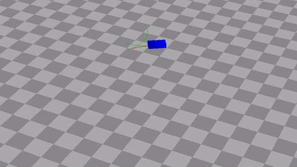
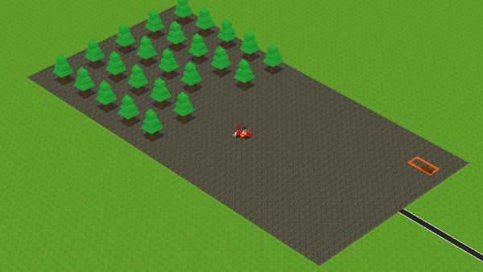

# RSMotion - C++ Library for Reeds-Shepp Cars

A C++11 library for calculating optimal paths of car movements using [Reeds-Shepp Cars](https://projecteuclid.org/euclid.pjm/1102645450).

## Introduction

Let's assume a car has the following freedoms: 1) going forward or in reverse and 2) turning left or right. What is the optimal path for the car to go from point A to point B?

The RSMotion C++ library calculates this optimal path by using [Reeds-Shepp Cars](https://projecteuclid.org/euclid.pjm/1102645450). Based on a start position and destination it provides the path segments that define the optimal path. Each path segment is defined by its type (a _turn_ or _straight_), _length_ and direction (_forward_ or _reverse_). Typical applications are in robotics, computer games or other simulations.

In the video below you can see what the generated paths look like.



_Example of Reeds-Shepp paths. The car goes forwards on green path segments, and in reverse on red segments._



_Example of in-game usage of the RSMotion library. The forklift truck is picking up trees and bringing them to storage. The turns and straights are defined by Reeds-Shepp paths._

RSMotion is based on an implementation in the [OPML](http://ompl.kavrakilab.org/) library but has been rewritten to be independent of boost/OPML which makes it easier to embed. And to provide a modern C++ interface.

## How to embed?

The library consist of a single source file (.cpp) and a couple of headers (.h). The easiest way to use this library is to simply add the source and header files to your current project:

```
1. Copy the library/include/rsmotion directory to the include directory of your project
2. Copy library/src/rsmotion.cpp to the source directory in your project and include it into your build.
```

An alternative would be to create a static library and link that into your application.

RSMotion requires a C++11 compiler and has been tested with Clang 8.0 and Visual Studio 2017.

## How to use?

First include the header file:

```cpp
#include <rsmotion/rsmotion.h>
```

To calculate a path you must first specify a ```CarState``` for the initial position (a 3D vector) and orientation (Quaternion) of the car:

```cpp
using namespace rsmotion::math;

// set the wheelbase to 1 meter
const float wheelbase = 1.0f;

// set the start position to the origin
const Vec3f startPosition {0.f, 0.f, 0.f};

// set the orientation (yaw; around y axis) to zero degrees (i.e. no rotation)
const Quatf startOrientation { Vec3f{0,1,0}, Anglef::Degrees(0) };

// create the initial CarState
CarState carStart{{startPosition, startOrientation}, wheelbase};
```

After setting this up, you can calculate the optimal path by specifying the position and orientation of the _destination_:

```cpp
const Vec3f finishPosition {3.f, 0.f, 2.f};
const Quatf finishOrientation { Vec3f{0,1,0}, Anglef::Degrees(65) };
const PointState finishPoint {finishPosition, finishOrientation};

const auto path = SearchShortestPath(carStart, finishPoint);
```

Using the returned path, you can move the car along the path using either a normalized progress value [0.f, 1.0f] :
```cpp
const float progressNormalized = 0.3f;
CarState movedCar = TraversePathNormalized(progressNormalized, path, carStart);
```

or with the travelled distance along the path:

```cpp
const float distanceTravelled = 1.2f;
CarState movedCar = TraversePathDistance(distanceTravelled, path, carStart);

// movedCar now contains the position and orientation
// of both the rear (movedCar.Rear) and front (movedCar.Front) axes.
```

### Coordinate system

The library uses 3D vectors for representing positions as this is likely to be more common in 
applications. However, it projects onto a 2D plane before calculating the optimal path.
The default coordinate system assumes [RIGHT, UP, FORWARD] as the axes. If you use another coordinate system, you'll have 
to change this in [coordinatesystem.h](library/include/rsmotion/coordinatesystem.h).


## Building the example

An [example application](example/src/main.cpp) resides in the [example](example/) directory. Currently it only builds on Win64 out of the box, as I have only added Win64 binaries of the [bgfx](https://github.com/bkaradzic/bgfx) library (a low-level graphics API). It should work on other OS-es but you have to build and link the bgfx library (and its dependencies) yourself.

The example requires [CMake](https://cmake.org/) to build.

Instructions when using VS 2017 (from the root of the project):

```
PS> mkdir example/build
PS> cd example/build
PS> cmake ../ -G "Visual Studio 15 2017 Win64"
PS> msbuild /p:Configuration=Release .\example.sln
PS> .\Release\example.exe
```

Obviously, you can specify another generator for CMake if you have a newer version of Visual Studio or use another build system such as Ninja.

If you see a black screen: ensure that you invoke the executable from a working directory that contains the shaders (```fs_cubes.bin/vs_cubes.bin```).


## How does it work?

Well, to get to know how it _really_ works is to read the [paper](https://projecteuclid.org/euclid.pjm/1102645450) by Reeds and Shepp. It shows that the calculations and proofs are quite involved. Fortunately we only have to implement it.

Basically, each path is defined by three to five path segments. Each segment can be either a turn (notated as the _character_ `C`) or a straight (notated as the _character_ `S`). For example, a path with 1) a turn, 2) a straight, and 3) a turn can be notated as the _word_ `CSC`. Another example would be three turns: `CCC`. Note that a turn can either go left or right. Also, a turn can be a of 0 degrees which essentially reduces the turn to a no-op.

As it turns out, all optimal paths can be defined by one of five _words_. This is reflected in the code:
```cpp
Path SearchShortestPath(State toState)
{
    // the optimal path is always one of
    // these five path configurations
    return std::min({CSC(toState),
                     CCC(toState),
                     CCCC(toState),
                     CCSC(toState),
                     CCSCC(toState)});
}
```

For each of these five configurations we test a variety of paths by _reflecting_ and _time-flipping_ (going in reverse). Out of all valid paths (those that reach the destination) we take the path with the minimum length:

```cpp

template <class R>
Path CalculateMinPath(Path basePath, State toState, R baseFormula)
{
    Path minPath;

    // for each equation, try each operation and return the shortest
    if (baseFormula(toState, basePath))
    {
        minPath = std::min(minPath, basePath);
    }
    if (baseFormula(Reflect(toState), basePath))
    {
        minPath = std::min(minPath, Reflect(basePath));
    }
    if (baseFormula(Timeflip(toState), basePath))
    {
        minPath = std::min(minPath, Timeflip(basePath));
    }
    if (baseFormula(Reflect(Timeflip(toState)), basePath))
    {
        minPath = std::min(minPath, Reflect(Timeflip(basePath)));
    }

    return minPath;
}
```

As you can see the algorithm is a kind of brute-force approach in that it calculates a lot of alternatives and simply picks the one with the smallest length. However, the result is proven to be optimal and the search space is reduced by recognizing that some paths are isomorphic to others. I have not done measurements on the runtime but I expect it to not vary too much between path searches. It certainly is not dependent on the path length.

## Limitations

There are some limitations to consider:

* There is no collision detection with walls or other inanimate objects. It assumes a total open space.
* The turn radius is currently equal to the unit circle.
* The progression along a path does not take into account (de)acceleration and assumes constant speed.

You might want to add this functionality to your application if it demands it. This library will unlikely fulfill all the requirements of your application. As adaptations of the library are to be expected it is okay to take the library as good start and build upon it.


## License

> The MIT License (MIT)
>
> Copyright (c) 2019 Bas Geertsema <mail@basgeertsema.com>
>
> Permission is hereby granted, free of charge, to any person obtaining a copy of
> this software and associated documentation files (the "Software"), to deal in
> the Software without restriction, including without limitation the rights to
> use, copy, modify, merge, publish, distribute, sublicense, and/or sell copies
> of the Software, and to permit persons to whom the Software is furnished to do
> so, subject to the following conditions:
>
> The above copyright notice and this permission notice shall be included in all
> copies or substantial portions of the Software.
>
> THE SOFTWARE IS PROVIDED "AS IS", WITHOUT WARRANTY OF ANY KIND, EXPRESS OR
> IMPLIED, INCLUDING BUT NOT LIMITED TO THE WARRANTIES OF MERCHANTABILITY,
> FITNESS FOR A PARTICULAR PURPOSE AND NONINFRINGEMENT. IN NO EVENT SHALL THE
> AUTHORS OR COPYRIGHT HOLDERS BE LIABLE FOR ANY CLAIM, DAMAGES OR OTHER
> LIABILITY, WHETHER IN AN ACTION OF CONTRACT, TORT OR OTHERWISE, ARISING FROM,
> OUT OF OR IN CONNECTION WITH THE SOFTWARE OR THE USE OR OTHER DEALINGS IN THE
> SOFTWARE.